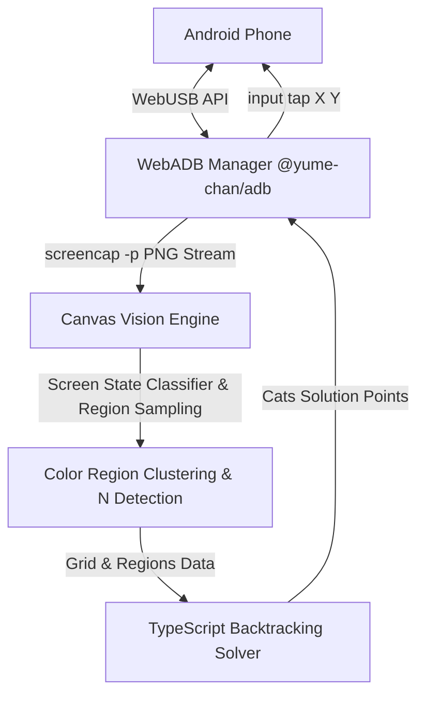

# 🐱 Meowdoku WebADB AI Solver

> **Automated WebADB & Computer Vision Bot for Meowdoku Mobile Game**

[](https://react.dev/)
[](https://www.typescriptlang.org/)
[](https://vitejs.dev/)
[](https://tailwindcss.com/)
[](https://wicg.github.io/webusb/)
[](LICENSE)

An intelligent, zero-install web application that connects directly to your Android device via **WebUSB API**, captures screen frames in real-time, performs dynamic grid size ($N \times N$) & color region detection using **Canvas Computer Vision**, auto-dismisses pop-up screens (Scoreboard / Victory Screens), and solves Meowdoku puzzles in under **5ms** using a high-speed **Backtracking Algorithm**.

---

## 🌟 Key Features

- 🔌 **Native WebADB (Zero Installation)**: Connect your Android phone directly in your browser using `@yume-chan/adb` over WebUSB — no need to install Android SDK or ADB CLI binaries.
- 🎨 **Canvas Computer Vision Engine**: Automatic dynamic grid size detection ($N \in \{10, 9, 8, 7, 6\}$), 720x1600 resolution scaling, 5x5 median RGB color sampling, and BFS connected-component region clustering.
- 🤖 **Automatic Screen State Classifier**: Detects playable puzzles, Scoreboard modal popups ("Papan Peringkat"), and Victory Next Level buttons ("Kelas Master"), automatically tapping to advance.
- ⚡ **Backtracking Puzzle Solver**: Fast algorithm enforcing 1 cat per row, 1 per col, 1 per color region, and no adjacent cats (Star Battle / Queens ruleset).
- 🔁 **Continuous Auto-Loop Mode**: Fully automated continuous level solving with built-in post-solve delays for 3-golden-fish animations.
- 🎯 **Interactive Canvas Visualizer**: Live phone screen preview with toggleable grid lines, color region overlays, and cat placement indicators in Neo-Brutalism Pastel design.
- 📜 **Diagnostics Terminal Output**: Real-time diagnostic logs displaying latency, grid dimensions, and ADB action status.

---

## 🚀 Quick Start

### 1. Requirements
- Desktop browser with WebUSB support: **Google Chrome, Microsoft Edge, Brave, or Opera**.
- Android device with **USB Debugging** enabled (*Developer Options → USB Debugging*).

### 2. Run Locally

```bash
# Clone the repository
git clone https://github.com/hrafsa/meowdoku-solver.git
cd meowdoku

# Install dependencies
npm install

# Start development server
npm run dev
```

Open `http://localhost:3000` in your browser.

---

## 📱 How to Use

1. Connect your Android phone to your computer using a USB cable.
2. Ensure **USB Debugging** is toggled ON on your phone.
3. Open the web app in **Chrome or Edge**.
4. Click **"Connect USB Device"** in the top right card and select your phone from the browser prompt.
5. Authorize the ADB debugging prompt on your phone screen.
6. Open the Meowdoku game on your phone and click **"Capture & Auto-Solve Phone"** or toggle **"Continuous Auto-Loop"**!

---

## 🏛️ System Architecture



---

## 📁 Repository Structure

```text
meowdoku/
├── src/
│   ├── components/
│   │   ├── DeviceConnector.tsx     # Top Navbar Header
│   │   ├── USBConnectionCard.tsx   # Card 1: WebUSB Device Pairing Card
│   │   ├── ControlPanel.tsx        # Card 2: Auto-Solve & Auto-Loop Controls
│   │   ├── CanvasVisualizer.tsx    # Big Left Box: Phone Visualizer & Status Badges
│   │   └── TerminalLogs.tsx        # Card 3: Diagnostics Log Window
│   ├── lib/
│   │   ├── adbManager.ts           # WebADB WebUSB connection & input tap execution
│   │   ├── visionEngine.ts         # Canvas computer vision, screen state classifier & N detection
│   │   └── meowdokuSolver.ts       # Backtracking algorithm engine
│   ├── App.tsx                     # Main application layout
│   ├── index.css                   # Neo-Brutalism Pastel design styles
│   └── main.tsx                    # React entry point
├── package.json                    # Node.js dependencies & build scripts
├── vite.config.ts                  # Vite configuration
└── README.md                       # Documentation
```

---

## 📜 License

This project is licensed under the [MIT License](LICENSE).
